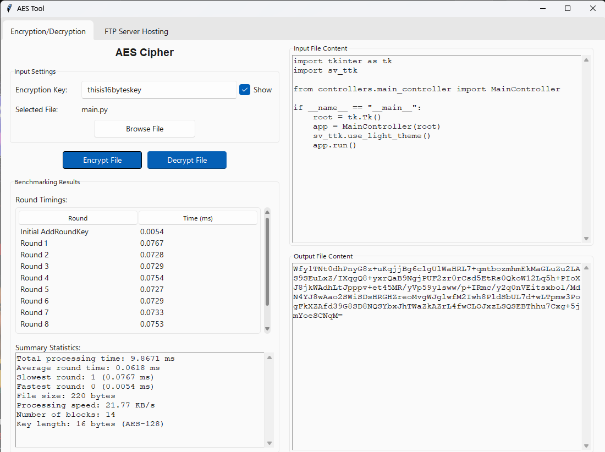

# PythonAES
This is a Python application that implements AES encryption/decryption without using external cryptographic libraries. It also includes an FTP server management system for file transfer.

<p align="center">
    

## Features
- AES encryption and decryption without external libraries
- FTP server for transferring encrypted files


## Prerequisites
Python

## Setup Instructions

### 1. Create a Virtual Environment
```sh
python -m venv venv
```

### 2. Activate the Virtual Environment
- **Windows**:
  ```sh
  venv\Scripts\activate
  ```
- **Linux**:
  ```sh
  source venv/bin/activate
  ```

### 3. Install Dependencies
```sh
pip install -r requirements.txt
```

### 4. Run the Application
```sh
python main.py
```

